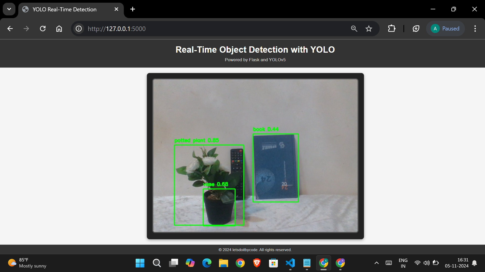

# 🎯 Object Recognition System

A real-time object detection system built using YOLOv5, Python, OpenCV, and Flask. The system processes live video streams from a webcam and displays detected objects with bounding boxes directly in the browser.

## 🗂️ Project Overview

This project demonstrates the integration of deep learning-based object detection into a web application. YOLOv5 is used as the core detection model, Flask serves as the backend API, and OpenCV handles real-time video processing.

## ✨ Features

- Real-time object detection via webcam
- Live video streaming to browser using Flask
- Bounding boxes with class labels and confidence scores
- Supports 80+ object categories (COCO dataset)
- Lightweight and fast — processes 30+ FPS
- Clean and responsive web interface

## 🛠️ Tech Stack

| Layer | Technology |
| --- | --- |
| Detection Model | YOLOv5 (PyTorch) |
| Backend | Python, Flask |
| Computer Vision | OpenCV |
| Frontend | HTML, CSS |
| Version Control | Git, GitHub |

## ⚙️ How to Run

**1. Clone the repository**
```bash
git clone https://github.com/Saurav0094/Object-Recognition-System.git
cd Object-Recognition-System
```

**2. Install dependencies**
```bash
pip install -r requirements.txt
```

**3. Run the application**
```bash
python app.py
```

**4. Open in browser**
http://localhost:5000

## 📁 Project Structure
Object-Recognition-System/
├── app.py                  # Main Flask application
├── requirements.txt        # Python dependencies
├── templates/
│   └── index.html          # Frontend UI
├── static/
│   └── style.css           # Styling
└── images/                 # Sample detection images

## 🧠 How It Works

1. Flask backend starts and initializes the YOLOv5 model
2. OpenCV captures live frames from the webcam
3. Each frame is passed through YOLOv5 for inference
4. Detected objects are annotated with bounding boxes and labels
5. Annotated frames are streamed to the browser in real-time

## 📊 Model Details

- **Model:** YOLOv5s (small variant for speed)
- **Dataset:** COCO (80 object classes)
- **Input Size:** 640x640
- **Inference Speed:** 30+ FPS on CPU

## 🚀 Future Improvements

- Add support for custom trained models
- Implement object tracking across frames
- Add detection history and analytics dashboard
- Deploy on cloud (AWS/GCP)

## 📸 Screenshots

### 🔍 Live Object Detection



## 👨‍💻 Author

**Saurav Yadav**
B.Tech CSE | Kanpur Institute of Technology
[🐙 GitHub](https://github.com/Saurav0094) | [💼 LinkedIn](https://www.linkedin.com/in/saurav-yadav-124293228/)
